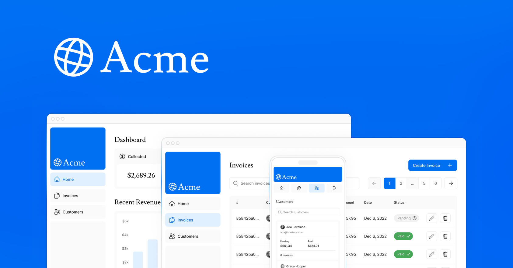

# Next.js Dashboard - App Router Fundamentals Course

Este é um painel administrativo construído com Next.js, Tailwind CSS e autenticação, utilizando o App Router. O projeto tem o intuito de fornecer um guia com os passos para aprender a base do `Next.js`.

---

## Tópicos abordados no curso:


## Pré-requisitos

- Node.js 18+
- pnpm (ou npm/yarn)
- Git

## Instalação

Clone o repositório e instale as dependências:

```bash
#Clone o projeto:
git clone https://github.com/ismael-henrique-dev/Next.js-Dashboard-Course.git

#Entre na pasta do projeto:
cd nextjs-dashboard

#Instale as dependências:
pnpm install
```

## Scripts Disponíveis

- `pnpm dev` — Inicia o servidor de desenvolvimento
- `pnpm build` — Gera a build de produção
- `pnpm start` — Inicia o servidor em modo produção
- `pnpm lint` — Executa o linter

## Estrutura do Projeto

```
/
├── app/                # Páginas e rotas (App Router)
│   ├── dashboard/      # Dashboard e subrotas
│   ├── login/          # Página de login
│   └── ...             # Outras rotas
├── public/             # Arquivos estáticos e imagens
├── ui/                 # Componentes reutilizáveis
├── lib/                # Funções utilitárias e dados 
├── auth.ts             # Configuração de autenticação
├── middleware.ts       # Middlewares de autenticação/rotas
├── tailwind.config.ts  # Configuração do Tailwind CSS
├── next.config.js      # Configuração do Next.js
├── package.json
└── README.md
```

## Referências

- [Documentação Next.js](https://nextjs.org/docs)
- [Tailwind CSS](https://tailwindcss.com/)
- [Curso Next.js App Router](https://nextjs.org/learn)

